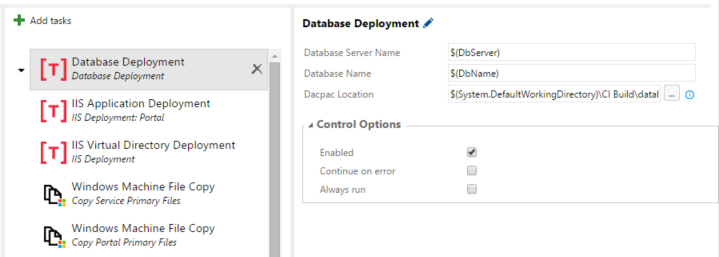

## Deploy Applications to your On-Premises Servers ##
This extension add tasks for deploying IIS Applications, Virtual Directories, Databases, and updating app settings and connection strings. Dragging and dropping these tasks into Release Management vNext is much easier than building your own Powershell scripts. All we require is that your build agent is on the same network as the machine you intend to deploy to. This can either be via an Azure virtual network or by hosting your own build agent On-Premises.

### Tasks Supported by this extension
- Deploying an IIS Application
-- This task depends on using Managed Service Accounts for security.
-- Task will remove existing Application Pool and Site from IIS.
-- Task then creates new App Pool and Website using specified Managed Service Account.

- Deploying a Virtual Directory
-- This task removes the existing Virtual Directory
-- The new Virtual Directory is created under the specified Application.

- Database Deployment
-- Deploy your databases from your database project. 

- Update App Settings
-- Reuse your same build between environments. All you have to do is update the configuration

- Update Connection Strings
-- Reuse your same build between environments. All you have to do is update the configuration

- Require SSL Redirect
-- This task allows you to force an IIS Application to only allow an SSL connection.

- Run Sql Command
-- Adds the ability to run an arbitrary Sql Command. This is useful if you need to reenable user permissions after restoring a database.

- Enable Windows Service
-- This task allows you to deploy a windows service and optionally install it if it doesn't exist.

- Disable Windows Service
-- This task allows you to disable a windows service. This is useful if you need to update the service 

### Roadmap
- Coming Soon!

## Release History
- 0.7.2 - Add the ability to set a description during the Enable Windows Service Task.
- 0.7.0 - Add additional functionality to the Enable Windows Service Task. Allow default account to be used when deploying IIS App Pools.
- 0.6.4  - Fix the Enable Service Account task so that it properly uses service accounts.
- 0.6.0 - Add the ability to run Sql Commands during a release
- 0.5.0 - Add the ability to enable/disable windows services as part of a build/release

### Quick steps to get started
1. Open the Visual Studio Team Service account where you installed the extension.

### Learn more about this extension
We have lots of documentation available over at github!: [https://github.com/TechnossusLLC/On-Premises-Release-Toolkit](https://github.com/TechnossusLLC/On-Premises-Release-Toolkit).
