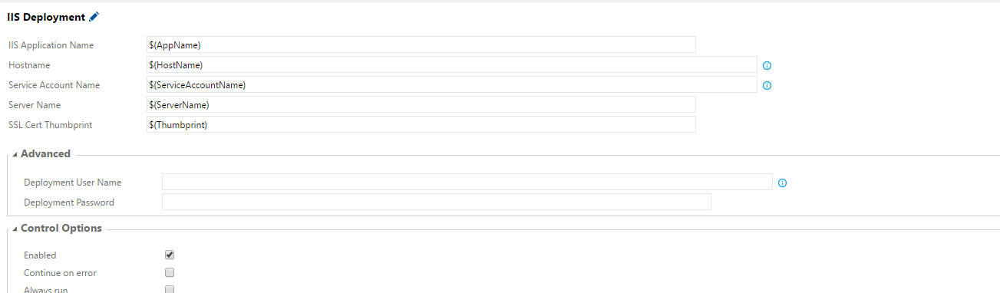

# Deploy IIS Application

This plugin allows you deploy an IIS Application. For every deploy, it follows the same workflow:

1. Check to ensure machine has IIS Installed
2. Check if Application already exists. If so, remove it.
3. Create new app pool using the gMSA provided in the configuration.
4. Creates a new folder under C:\Apps\{$name}
5. Creates a new Application
6. If SSL Thumbprint is provided, the script will also bind port 443 to the site and map the certificate. By default, the creation of the Application already binds port 80 to the Host Name provided.

## Inputs
------------------

There are 8 possible inputs for this Task

### Name - Required

The name of the IIS Application.

### Hostname - Required

The hostname that the application should respond to.

### Service Account Name - Required

The Service Account that the App Pool will run under. For security reasons, this can only take in a gMSA. For more information on how to use a gMSA, please check [here](http://jeffgraves.me/2014/10/07/managed-service-accounts-in-server-2012-r2/)

### Server Name - Required

Name of the server to deploy the application to

### Deploy User 

If the service account of the Build Agent does not have access to the destination server, you can override the user account which the work is done under.

### Deploy Password 

If the service account of the Build Agent does not have access to the destination server, you can override the user account which the work is done under.

## Certificate Thumbprint

If provided, the task will bind port 443 to the Application using the thumbprint provided
